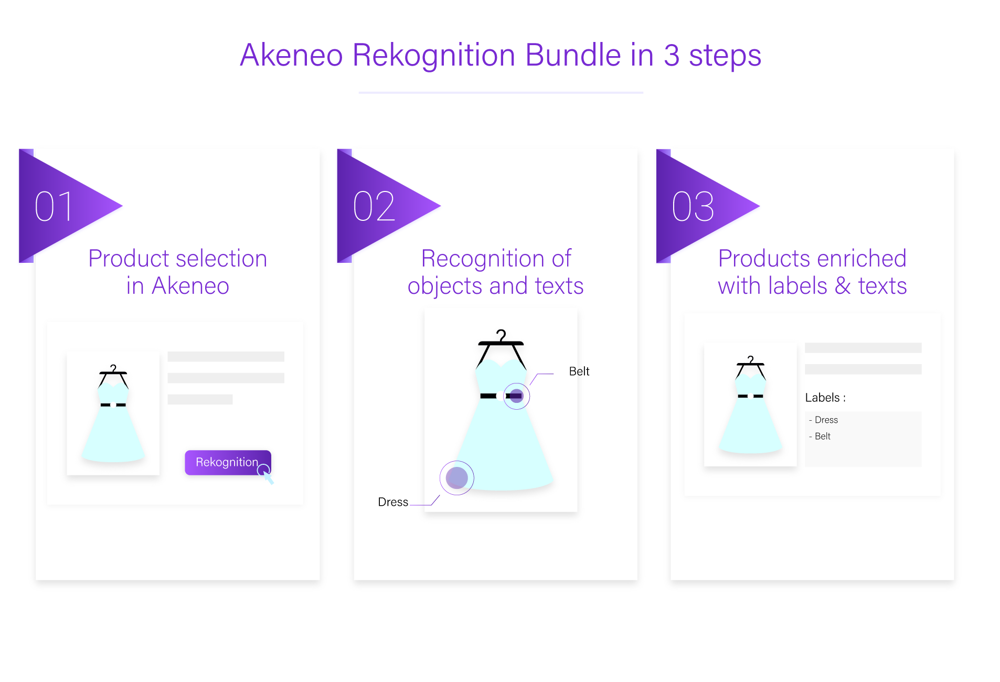

# Akeneo Rekognition Bundle - C&M

> Akeneo bundle to enrich products with objects and texts detected in images.

`Akeneo Rekognition Bundle` allows to retrieve objects and texts
detected with [AWS Rekognition](https://aws.amazon.com/rekognition/) 
(using [rekognition-php](https://github.com/ClickAndMortar/rekognition-php))
from a product model image and to store them into this product model.



## Versions

| **Bundle version**  | **Akeneo version** |
| ------------- | ------------- |
| v0.3.*  | v4.0.*  |
| v0.2.*  | v3.2.*  |

An AWS account is also required as
[AWS Rekognition](https://aws.amazon.com/rekognition/)
will be used.

## Installation

### Download the Bundle

```console
$ composer require clickandmortar/akeneo-rekognition-bundle
```

### Enable the Bundle

Enable the bundle by adding it to the list of registered bundles
in the `config/bundles.php` file of your project:

```php
<?php

return [
    ...
    ClickAndMortar\AkeneoRekognitionBundle\ClickAndMortarAkeneoRekognitionBundle::class => ['all' => true]
    ...
];
```

## Configuration

### Configure credentials

Before using `Akeneo Rekognition Bundle`,
[set credentials to make requests to Amazon Web Services](https://docs.aws.amazon.com/sdk-for-php/v3/developer-guide/guide_credentials.html).

In `config/services/services.yml`:

```
parameters:
    ...
    aws_access_key_id: <your_access_key_id>
    aws_secret_access_key: <your_secret_access_key>
    aws_rekognition_minimum_confidence: 75
    ...
```

### Import attributes

Import new attributes to store data from `Rekognition`:

```
php bin/console akeneo:batch:job -c "{\"filePath\":\"vendor/clickandmortar/akeneo-rekognition-bundle/Resources/fixtures/attributes.csv\"}" <your_attribute_import_job_code>
```

### Add new attributes to family

[Add new attributes to family](https://help.akeneo.com/articles/manage-your-families.html#manage-attributes-in-a-family)

### Edit a family variant (if necessary)

[Edit a family variant](https://help.akeneo.com/articles/manage-your-families.html#edit-a-family-variant)

### Create job
```
php bin/console akeneo:batch:create-job internal add_rekognition_data mass_edit add_rekognition_data '{}' 'Add Rekognition Data'
```

## Usage

### Run job

The following line will process all products and models and add data from Rekognition if attributes are editable from family.

```
php bin/console akeneo:batch:job add_rekognition_data
```

### Mass edit

From products / models list:
- Check the ones that need to be processed.
- Click "Mass edit".
- Click "Add Rekognition Data".
- Click "Next", "Next", then "Confirm".
- Check on dashboard that operation has status `Completed`.

Open products / models that were previously checked.
They now have attributes filled with Rekognition data (only if attributes are editable)

## Roadmap

- [ ] Handle locale as currently labels are in english
- [ ] Add fields to store more information provided by Rekognition
- [ ] Add `composer post install` to avoid to play some configuration commands
manually
- [ ] Find a way to use environment variables with php-fpm
(credentials AWS) for docker
